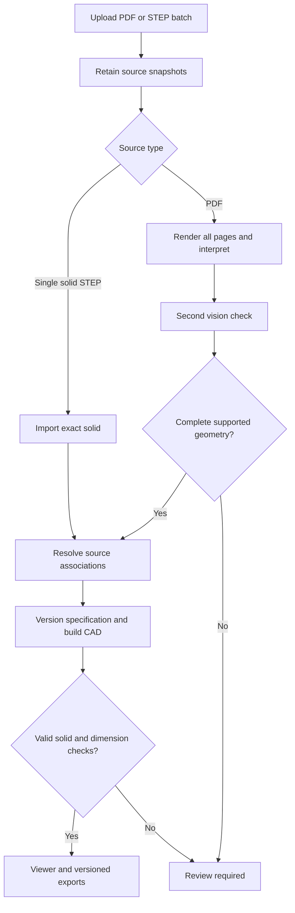

# Automatic source-to-geometry workflow

The feature branch now connects upload to interpretation, CAD construction, measured checks,
viewer and STEP/GLB/dimension-workbook exports. This is conditional automation for supported,
unambiguous geometry, not a guarantee that every drawing can be reconstructed correctly.



## Activation

Install `backend/requirements-geometry.txt` in the separate geometry environment. Set
`GENERIC_GEOMETRY_PYTHON` on the API/dispatcher to that interpreter. Set `GOOGLE_API_KEY`
in the worker environment and optionally `AUTOMATIC_DRAWING_MODEL` (default
`gemini-2.5-flash`). Keys are sent in headers, never URLs. Auto Convert jobs now
open this CAD workflow by default, regardless of `VITE_ENABLE_PART_SPEC`.
The job header provides an explicit legacy profile preview switch for comparison.
`VITE_ENABLE_PART_SPEC=true` still enables the review panels for other job modes.

New Auto Convert uploads send `automatic_geometry=true`; the server queues processing.
Existing jobs have a **Process uploaded sources** button. Use
**Retry automatic processing** to re-read sources after an extraction failure.

Invalid proposal/audit schemas get one correction attempt against the original
pages. Hole depths and thread lengths must be positive: zero never means THRU.
The model must derive a through depth from dimensioned local geometry and establish
thread extent separately, or return an incomplete proposal with unresolved reasons.
Repeated invalid responses stop with concise field errors; no dimensions are filled
in locally to force acceptance. A corrected complete proposal still needs the
independent drawing audit and geometry validation.

Use `GENERIC_GEOMETRY_QUEUE_ONLY=true` with `python -m app.workers.generic_queue` for a
supervised durable dispatcher, or the API background runner for development.

For the bolted-retainer case, use the original PDF in this workflow rather than
converting the legacy `llm_analysis.json` into a recipe: that scalar schema has no
reliable XY positions, pattern orientation, or complete thread geometry. Each hole
and thread must have its own explicit position and evidence. Solid centre means no
central bore; it does not suppress off-axis holes. Unsupported fillets and unknown
thread roots remain review items. The positioned-feature integration test uses an
explicit simplified recipe and is not a live accuracy test of this drawing.

Endpoints: POST/GET `/api/v1/jobs/{job_id}/automatic`; DELETE
`/api/v1/jobs/{job_id}/automatic/{run_id}`. Explicit retries use `?retry=true`.
Repeated starts reuse the current run. Retries preserve existing accepted specifications;
use review/build controls for corrections instead of silently replacing them.

## Validation and limits

- All PDF pages are rendered (maximum 20 pages, 15 MiB rendered images, 64 sources per batch).
- A strict schema allows cylinder, box, straight-segment revolve and supported positioned cuts.
- Source dimensions convert from inches to mm once. Axes remain unit vectors.
- Evidence and a second model check must cover the base and every explicit feature.
- Independent dimension observations from that second call are compared with measured CAD
  before exports. Two model calls are not independent engineering certification.
- Missing geometry, conflicting identity/revision, competing governing sources, unsupported
  fillets/curves or unspecified thread geometry require review. No envelope-only fallback
  is published as a complete part. Exact thread fit certification is not implemented.
- Single-solid STEP import preserves actual geometry and source XYZ. CAD identity defaults
  to a content hash; manufacturing state remains unresolved rather than being invented.
  Multi-solid STEP requires explicit body selection in review.
- Source/correction changes invalidate results; artifact downloads check current versions
  and hashes. Cancellation prevents unfinished results from being published.
- RFQ export contains measured dimensions and evidence. Commercial pricing is not inferred.

## Test evidence and outstanding release gates

The implementation tests exercise real CAD and subprocess execution, authenticated endpoints,
multipart upload, inch/mm conversion, hollow bores, STEP round-trip, GLB/XLSX exports,
duplicate sources, source changes, cancellation, dimension mismatches and provider errors.
PDF interpretation success tests use controlled provider responses, not live AI results.
Frontend component tests mock WebGL; a passing build does not validate browser rendering.

Reference corpus run: all 24 PDFs from the supplied archive reached a durable `blocked`
result because GOOGLE_API_KEY was absent. No model was published. Live extraction accuracy
was **not** measured. The 18 finished-drawing PDFs had no extractable text. Chromium could
not be downloaded in this execution environment, so real browser interaction remains untested.

Reproduce a real-data run from backend using the geometry interpreter:

```bash
python -m scripts.validate_automatic_corpus --input /path/to/drawings --report /tmp/report.json
```

Optional `--expected` accepts independently verified filename-to-measurement bounds in mm.
The script returns exit 2 for blocked/review/mismatch outcomes. Supply provider credentials,
engineer-verified expected measurements and a browser environment before release approval.
No production deployment is included in this change.
