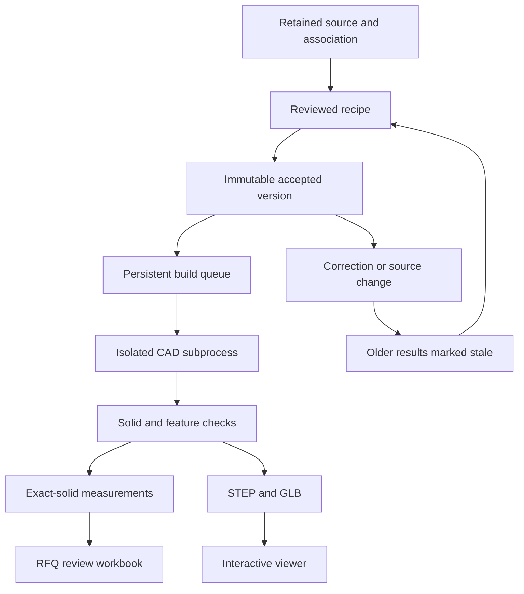

# Source-reviewed geometry: integration and operating guide

## Implemented end-to-end path

Upload through the existing job API → retained source registry → explicit part/revision
association → review a typed geometry recipe → accept a version → queue construction →
validate a real solid → measure that selected solid → inspect its GLB → download STEP,
GLB, a dimension-only RFQ workbook and a manifest. Corrections create new accepted
versions; old builds become stale and their artifact endpoints return 409.

This is a **source-reviewed reconstruction workflow**, not a claim of automatic,
accurate reconstruction of every drawing. A per-document adapter invokes existing
PDF extraction on the selected retained original and proposes candidate OD/length
values. It excludes the parser's raw-stock `max_od_in`/`max_length_in` fields. Results
are retained as unverified analyses; an LLM ACCEPT recommendation cannot approve them.
Job-wide legacy summaries do not prefill a selected source's recipe. Process drawings
are rejected by this finished-dimension extraction path. Feature interpretation and sufficiency beyond the supported schema
require review. A successful build proves construction from the accepted recipe and
the implemented checks, not independent agreement with every drawing requirement.



## Supported construction

All recipe coordinates and linear dimensions are millimetres. The API rejects
unknown operations, nonfinite numbers, invalid axes, duplicate feature IDs and
inconsistent completeness declarations. No generated code is evaluated.

| Operation | Implemented behaviour |
|---|---|
| Cylinder | Radius from diameter, axis +Z, base Z=0 |
| Rectangular block | Centred XY, base Z=0, explicit width/height/length |
| Revolved profile | Closed straight-edged radius/Z polygon; supports steps, tapers and inner profiles |
| STEP import | Explicit retained source and zero-based solid index; preview and measurements use the same selected solid |
| Hole | True cylindrical Boolean cut on an explicit axis; through-endpoint and blind-bottom checks |
| Pocket / slot | Rectangular Boolean cut in a local frame |
| Counterbore | Additional coaxial cylindrical cut with its own depth |
| Countersink | Explicit conical cut with entry/end diameters and depth |
| Circular patterns | UI expands quantity, XY bolt circle and angular offset into distinct positioned features |
| Internal / external thread | Actual left- or right-handed swept helical groove; explicit diameters, pitch, groove width and length |

Internal threading requires a previously modelled bore. Thread profiles are
representative triangular grooves, not certified UNC/UNF/UNS/UN or other fit-class
models. Callout metadata is retained and a limitation is included in every manifest
and workbook. No standards table, root/crest truncation, lead-in or runout is invented.

Arbitrary blends/fillets, curved profile segments, spherical features, tapered pipe
threads, sheet-metal unfolding, gears, full assemblies and proprietary CAD formats
are not yet implemented here. Do not declare a recipe complete if the drawing
depends on one of those features. Use a partial recipe with explicit unresolved
items, or import an appropriate STEP solid.

## Measurement and output contract

The exact solid is measured with Open CASCADE bounds without display triangulation.
Volume comes from the solid. OD is the largest surviving outward coaxial cylindrical
surface about Z for cylinder/revolve recipes. It is **not** a universal radial envelope:
purely tapered or imported geometry may return null. Rectangular parts return no OD.
The current UI/export names this field “maximum outer cylindrical diameter.”

Length is Z extent in the declared/source frame, not the longest dimension. Imported
STEP does not automatically infer a machining axis. Coaxial cylindrical bore stations
are reported separately. A minimum through-bore diameter is emitted only when those
stations cover the full axial range and an exact centre-line intersection finds no
obstructing material; internal conical surfaces make that scalar unresolved. Blind
holes and off-axis bolt patterns do not create a fictitious central ID. Full bore
networks, conical minima, upper/lower tolerance limits and GD&T inspection remain separate work.
The builder does not interpret nominal model extents as maximum permitted sizes.

STEP geometry uses millimetres; GLB vertices use metres. A display tessellation
tolerance of 0.02 mm is recorded separately from measurements. Re-import tests compare
STEP dimensions/volume, and topology tests inspect whether material exists at known
points. Rotating the viewer does not alter measured dimensions.

`rfq_review.xlsx` contains identity, version, inch/mm dimensions, nominal volume,
source locators and limitations. It is a new review export. The legacy commercial RFQ
template/costing path is unchanged: no material density, stock allowance, rates,
exchange rate or selling price is guessed. Text cells are explicitly strings to
prevent source text becoming Excel formulas. A partial recipe's volume is labelled
accordingly. A quote-ready price calculation is not implied by this export.

## Source review and versioning

1. Enable the UI flag and open a job.
2. Register/refresh documents. Associate each source with its part, revision, role and
   manufacturing state. Multi-operation process documents stay unresolved until
   their operation-specific facts are identified.
3. Load sources/current results in the reviewed geometry panel. Select an explicitly
   revisioned finished drawing or finished CAD source. Open its retained PDF to check
   the proposed dimensions. CAD imports require the chosen solid index.
4. Enter the base, features and source/view references. Declare missing features in
   the unresolved list. Record modelling choices in the review note.
5. Accept the specification, build it and inspect both holes and section views.
6. Export only the accepted version's artifacts. Changes require a new acceptance.

Each accepted recipe is immutable in SQLite and records the governing document,
evidence locators, registry version, part/revision identity and accepted version.
`expected_version` and `expected_registry_version` prevent stale edits. All selected
evidence must be associated with the same part/revision. A raw/intermediate process
document cannot govern a finished recipe. Unknown revisions must be resolved; `--`
may be used only when the drawing explicitly indicates an unrevised issue.

Conservative invalidation currently marks accepted recipes stale after **any** source
registry change in the job. This can invalidate unrelated parts but cannot silently
keep affected results current. Fine-grained per-document dependency invalidation is
a future optimization. A history API preserves past recipes and build status; stale
artifacts are retained for audit but are not downloadable through the current-output
endpoint. The UI clears a visible result when its recipe inputs change, and rechecks
completed build status periodically to detect external changes.

## API integration

All endpoints below inherit the existing job router authentication and verify job IDs.
They are additive; existing job/conversion/RFQ contracts stay available.

| Method / path under `/api/v1/jobs/{job_id}` | Purpose |
|---|---|
| `POST /documents/{document_id}/analyze` | Source-specific PDF extraction using existing provider configuration; candidates only |
| `GET /accepted-parts` | All accepted recipe versions and staleness |
| `POST /accepted-parts` | Accept a source-linked specification/correction |
| `POST /accepted-parts/{spec_id}/build` | Queue or resume construction |
| `GET /accepted-parts/{spec_id}/builds` | Build history for the specification |
| `GET /geometry-builds/{build_id}` | Persistent status, errors and measurements |
| `DELETE /geometry-builds/{build_id}` | Cancel queued/running work; prevent publication |
| `GET /geometry-builds/{build_id}/artifacts/{filename}` | Current completed artifact only |

Allowed artifacts are `model.step`, `model.glb`, `rfq_review.xlsx` and `manifest.json`.
They live in `outputs/accepted/{build_id}`; multiple parts/builds never share a model
filename directory. The manifest records specification identity, source-registry
version, builder version, completeness, checks, warnings and artifact hashes.
An incomplete/failed/cancelled/stale build cannot supply a success artifact. Corrupted
STEP/GLB/workbook bytes are rejected by the download integrity check.

## Installation and execution

The existing backend depends on NumPy <2. CadQuery's dependencies differ. Install
the geometry worker in a separate environment rather than upgrading the backend's
numerical stack implicitly. From the repository root, using Python 3.11 or 3.12:

```bash
python3 -m venv /opt/rfq-geometry-venv
/opt/rfq-geometry-venv/bin/pip install -r backend/requirements-geometry.txt
```

Configure the backend service environment:

```text
GENERIC_GEOMETRY_PYTHON=/opt/rfq-geometry-venv/bin/python
```

Build the frontend with:

```bash
cd frontend
VITE_ENABLE_PART_SPEC=true npm run build
```

By default the API schedules a bounded subprocess after enqueueing. There are at most
two concurrent geometry processes per API process, each limited to 300 seconds.
Cancellation terminates the child and prevents publication. A changed source/spec
version also stops an active runner. The worker validates versions again before
publishing. Failed Boolean cuts fail the build rather than disappearing from the model.

For production use a dedicated dispatcher, set `GENERIC_GEOMETRY_QUEUE_ONLY=true`
on the backend, and run from `backend` in a supervised service:

```bash
GENERIC_GEOMETRY_PYTHON=/opt/rfq-geometry-venv/bin/python \
  /path/to/backend-venv/bin/python -m app.workers.generic_queue
```

Use the same job-storage environment and filesystem permissions as the backend.
Use process-group cleanup (for example systemd `KillMode=control-group`) so a stopped
dispatcher does not leave CAD subprocesses behind. One dispatcher executes builds
serially; SQLite claims prevent duplicate execution if more dispatchers are started.
Queued work survives restart. Running leases older than 360 seconds become failed
with an explicit retry message. `--once` drains currently queued work for maintenance
or tests. A failed build can be retried without deleting its history.

The existing `deploy.sh` still deploys master and does not install this optional worker.
It has deliberately not been executed or redirected to the feature branch. Deployment
requires installing the worker, setting service environment and selecting the tested
release commit. Disabling the UI flag rolls back the new user flow without changing
legacy outputs; preserve the job data directory when rolling back code.

## Verification and remaining release gates

Backend tests cover acceptance conflicts, source revision invalidation, cancellation,
real through/blind bores, circular patterns, transverse bores, revolved profiles,
internal/external helical cuts, selected STEP bodies, formula-safe spreadsheets,
authenticated API-to-worker-to-export flow, queue recovery and stale/corrupt artifacts.
Frontend tests cover review/accept/build integration, input-change invalidation,
stale-result suppression and bolt-circle placement. Production builds exercise types
and the feature-flag path. Component tests mock WebGL; a real-browser interaction
smoke test is still required on the target deployment.

The live extraction provider requires the existing model credentials and has not been
called against customer drawings during these implementation tests. The source binding,
stock/finished filtering and review gating are tested with a deterministic provider
stub. Live provider accuracy/quota behaviour remains a deployment acceptance check.

The supplied 18 drawing families are not an engineer-verified ground-truth dataset.
Independent drawing-to-model acceptance, unseen-family benchmarks, broader automated
feature extraction, full tolerance/standard-thread semantics, precise face-to-evidence
highlighting and legacy quote-template migration remain release gates. This document
does not label those capabilities complete merely because the supported recipe
workflow runs end to end.

References: [CadQuery shape API](https://cadquery.readthedocs.io/en/latest/classreference.html)
and [Open CASCADE precise bounding API](https://occt3d.com/dev/doc/refman/html/class_b_rep_bnd_lib.html).
