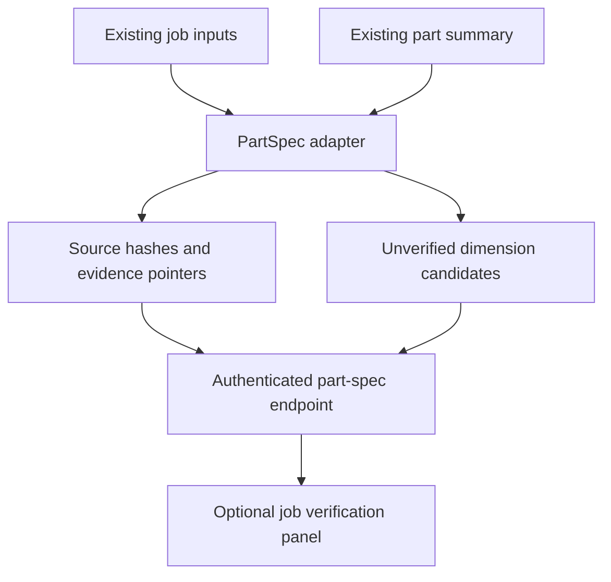

# Generic PartSpec foundation — first implementation slice

Baseline: master at `27ecd50df2ea6eba7aac968d888a214791fc1f34`.

The part-spec endpoint is an additive, read-only compatibility bridge. Existing conversion,
viewer and RFQ responses are unchanged. It does not yet implement new OCR,
solid construction, true threads, durable jobs or correction history.

## Integrated path

`GET /api/v1/jobs/{job_id}/part-spec` uses existing authentication, job existence
checks and storage path validation. It returns the v0.1 Pydantic contract.
The route is synchronous so file reads execute in FastAPI's worker threadpool.
No LLM/CAD calls are introduced. Files are hashed on demand, not on a polling loop.

Set `VITE_ENABLE_PART_SPEC=true` when building the frontend to show the panel.
Click **Refresh verification** after processing completes. The UI uses the existing
authenticated API client, and displays source artifact pointers beside candidates.
The flag defaults off. It controls the UI only; the read-only API remains available.

## Meaning and safeguards

- `snapshot_id` fingerprints the response, including source hashes and adapter
  version. It is not persisted revision history or a cross-file atomic transaction.
- Job scope is explicit. Part ID, revision, manufacturing state and selected bodies
  remain unresolved; filenames do not establish their identity.
- The source list inventories current stored inputs. The second slice below adds
  retained originals and versioned associations. It cannot recover files overwritten
  before that slice was installed.
- Maximum OD is a candidate from all valid summary segments with known units.
  If any OD is invalid, no partial maximum is emitted. No bore/ID is invented.
- `totals.total_length_in` is explicitly inches independent of segment units.
  Values normalize to mm. These are legacy model extents, not upper tolerance limits.
- Confidence scores, STEP existence and mesh existence cannot promote acceptance.
  Fact, measurement, geometry and quote readiness remain separate.
- Invalid, unfinished or oversized summaries return review issues. Source content
  is never modified. Excel lock files are excluded from inventory.
- Multi-input jobs require source association. No claim is made that their existing
  shared summary belongs to every input or represents a selected finished revision.

## Validation

From `backend`: `python -m pytest tests/test_part_spec.py`.
From `frontend`: `npm run test:run -- src/__tests__/PartSpecPanel.test.tsx`.
Run `npm run build` to check integration against the frontend type/build gates.

## Next increments

1. Source-to-model/body linkage and governing revision selection (document registry implemented below).
2. Source-crop evidence and typed dimensions/tolerances/features with sufficiency checks.
3. Persisted accepted corrections, optimistic version checks and dependency invalidation.
4. One turned and one prismatic part through accepted geometry, measurements and RFQ.
5. Patterns, real threads and hybrid solids with independent reference validation.

Do not use this bridge's candidates to replace production RFQ dimensions until
source association and acceptance are implemented. The frozen v0.1 contract makes
that boundary explicit: its dimension acceptance enum only permits `unverified`.

## Second slice: persistent documents and source associations

Supported direct uploads, remote byte saves and extracted PDF/STEP ZIP members now
register automatically through `FileStorage`. Same-name uploads use exclusive creation
and a unique suffix rather than overwriting earlier files, including concurrent uploads.
Each source has a retained content-addressed copy in `source_registry/blobs`, outside
the input/output scans. Per-job SQLite metadata stores its hash, path and original name.
The retained copy is never overwritten by application registration. Deleting a job
still deletes its registry and retained originals with the rest of the job.

This is application-level retention, not an operating-system write-protection guarantee.
Local privileged edits and storage loss are outside this implementation. Source copies
increase storage use; identical content within a job shares one retained blob.
ZIP member paths are retained as original names. The full locally uploaded ZIP container
and unsupported members are not retained by this slice; existing accepted formats remain
PDF/STEP/STP. No broader format support is implied by the association role choices.

New authenticated routes under `/api/v1/jobs/{job_id}`:

| Route | Purpose |
|---|---|
| `GET /documents` | Registry version and source inventory |
| `POST /documents/register` | Explicit idempotent backfill of existing inputs |
| `PUT /documents/{document_id}/association` | Assign part number, optional revision, role and manufacturing state |
| `GET /documents/{document_id}/history` | Versioned association history |
| `GET /documents/{document_id}/original` | Download the retained original bytes |

Association writes require `expected_version`. A SQLite transaction serializes edits;
a stale version returns 409 rather than replacing another edit. Each accepted edit
has an ordered history record. This audit tracks payload/version/time, not individual
reviewer identity: the application still uses its existing shared-key authentication.
Unknown revisions stay null. Multi-operation process PDFs should use unresolved state
until page/operation-specific associations are implemented.

Enable the same `VITE_ENABLE_PART_SPEC=true` frontend flag to see **Document associations**.
Register/refresh sources, select a document, enter its identity and save. Saving or
refreshing clears the displayed verification snapshot; refresh verification to inspect
the new state. A 409 is displayed without an automatic retry or silent overwrite.

PartSpec adds `registry_version` and typed per-source `association`. Registry changes
change its content fingerprint. Different revisions for one part produce a conflict
issue. If legacy input bytes change, the old association does not transfer to the new
content. The old original remains downloadable, and a source-content-change issue appears.

Document association does not select a governing revision, bind a legacy model to a
source, approve dimensions, or rebuild CAD/RFQ artifacts. Those outputs remain unverified.
Full accepted corrections and downstream artifact invalidation are the next slice.

Additional checks: `python -m pytest tests/test_part_spec.py tests/test_document_registry.py`
from backend; `npm run test:run` and `npm run build` from frontend.
