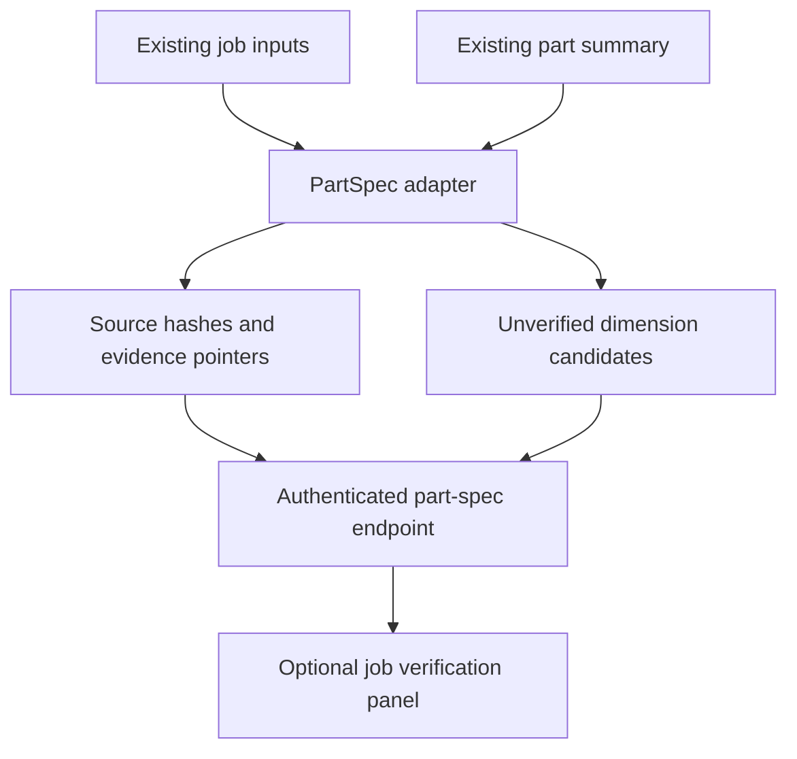

# Generic PartSpec foundation — first implementation slice

Baseline: master at `27ecd50df2ea6eba7aac968d888a214791fc1f34`.

This is an additive, read-only compatibility bridge. Existing conversion,
viewer and RFQ responses are unchanged. It does not yet implement new OCR,
solid construction, true threads, durable jobs or correction history.

## Integrated path

`GET /api/v1/jobs/{job_id}/part-spec` uses existing authentication, job existence
checks and storage path validation. It returns the v0.1 Pydantic contract.
The route is synchronous so file reads execute in FastAPI's worker threadpool.
No LLM/CAD calls are introduced. Files are hashed on demand, not on a polling loop.

Set `VITE_ENABLE_PART_SPEC=true` when building the frontend to show the panel.
Click **Refresh verification** after processing completes. The UI uses the existing
authenticated API client, and displays source artifact pointers beside candidates.
The flag defaults off. It controls the UI only; the read-only API remains available.

## Meaning and safeguards

- `snapshot_id` fingerprints the response, including source hashes and adapter
  version. It is not persisted revision history or a cross-file atomic transaction.
- Job scope is explicit. Part ID, revision, manufacturing state and selected bodies
  remain unresolved; filenames do not establish their identity.
- The source list inventories existing stored files; it is not yet an immutable
  upload registry. It cannot recover files overwritten by the old upload code.
- Maximum OD is a candidate from all valid summary segments with known units.
  If any OD is invalid, no partial maximum is emitted. No bore/ID is invented.
- `totals.total_length_in` is explicitly inches independent of segment units.
  Values normalize to mm. These are legacy model extents, not upper tolerance limits.
- Confidence scores, STEP existence and mesh existence cannot promote acceptance.
  Fact, measurement, geometry and quote readiness remain separate.
- Invalid, unfinished or oversized summaries return review issues. Source content
  is never modified. Excel lock files are excluded from inventory.
- Multi-input jobs require source association. No claim is made that their existing
  shared summary belongs to every input or represents a selected finished revision.

## Validation

From `backend`: `python -m pytest tests/test_part_spec.py`.
From `frontend`: `npm run test:run -- src/__tests__/PartSpecPanel.test.tsx`.
Run `npm run build` to check integration against the frontend type/build gates.

## Next increments

1. Immutable upload registry and explicit source-to-part/revision/body association.
2. Source-crop evidence and typed dimensions/tolerances/features with sufficiency checks.
3. Persisted accepted corrections, optimistic version checks and dependency invalidation.
4. One turned and one prismatic part through accepted geometry, measurements and RFQ.
5. Patterns, real threads and hybrid solids with independent reference validation.

Do not use this bridge's candidates to replace production RFQ dimensions until
source association and acceptance are implemented. The frozen v0.1 contract makes
that boundary explicit: its dimension acceptance enum only permits `unverified`.
